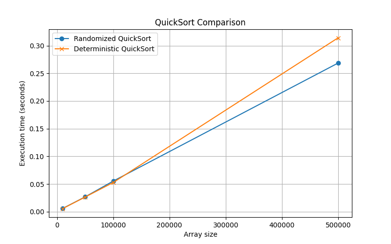

# goit-algo2-hw-10
The repository for the 10th GoItNeo Design and Analysis of Algorithms homework

### Task 1: Comparison of Randomized and Deterministic QuickSort

Implement randomized and deterministic QuickSort algorithms. Conduct a comparative analysis of their efficiency by measuring the average execution time on arrays of different sizes.

#### Requirements:
1. To implement the randomized QuickSort algorithm, implement the function randomized_quick_sort(arr), where the pivot element is chosen randomly.

2. To implement a deterministic QuickSort algorithm, implement the function deterministic_quick_sort(arr), where the pivot element is chosen according to a fixed rule: the first, last, or middle element.

3. Create a set of test arrays of different sizes: 10,000, 50,000, 100,000, and 500,000 elements. Fill the arrays with random integers.

4. Measure the execution time of both algorithms on each array. For a more accurate assessment, repeat the sorting of each array 5 times and calculate the average execution time.

#### Results:

Test results (sec):
Size      Randomized          Deterministic       
10000     0.005815            0.005512            
50000     0.026765            0.026461            
100000    0.055283            0.052740            
500000    0.268534            0.314119  

#### Conclusion:
The test results indicate that both Randomized QuickSort and Deterministic QuickSort perform similarly in terms of execution time across different input sizes. However, there are some key observations:

- Small Inputs (10,000 - 100,000 elements)

The deterministic version is slightly faster than the randomized version, likely due to reduced overhead from random pivot selection.

- Large Input (500,000 elements)

The randomized version outperforms the deterministic approach, completing in 0.2685s compared to 0.3141s for the deterministic version.

This suggests that randomized pivot selection helps prevent worst-case performance in larger datasets.

Key Takeaways:

- For small datasets, deterministic QuickSort can be slightly faster due to lower overhead.

- For larger datasets, randomized QuickSort performs better, likely due to its ability to avoid consistently poor pivot choices.

- The difference is not drastic, but the randomized approach scales better for large inputs.

### Task 2. Creating a class schedule using a greedy algorithm

Implement a program for creating a university class schedule using a greedy algorithm for the set cover problem. The goal is to assign teachers to subjects in such a way as to minimize the number of teachers and cover all subjects.

#### Requirements:
1. Given a set of subjects: {'Mathematics', 'Physics', 'Chemistry', 'Informatics', 'Biology'}

List of teachers:
- Oleksandr Ivanenko, 45 years old, o.ivanenko@example.com, subjects: {'Mathematics', 'Physics'}

- Maria Petrenko, 38 years old, m.petrenko@example.com, subjects: {'Chemistry'}

- Serhiy Kovalenko, 50 years old, s.kovalenko@example.com, subjects: {'Informatics', 'Mathematics'}

- Natalia Shevchenko, 29 years old, n.shevchenko@example.com, subjects: {'Biology', 'Chemistry'}

- Dmytro Bondarenko, 35 years old, d.bondarenko@example.com, subjects: {'Physics', 'Informatics'}

- Olena Hrytsenko, 42 years old, o.grytsenko@example.com, subjects: {'Biology'}

2. Implement the Teacher class with the following attributes:

- first_name (name)

- last_name (surname)

- age (age)

- email (electronic mail)

- can_teach_subjects (a set of subjects that can be taught)

3. Implement the function create_schedule(subjects, teachers), which uses a greedy algorithm to assign teachers to subjects. The function should return a list of teachers and the subjects assigned to them.

4. When selecting a teacher at each stage, prioritize the one who can teach the greatest number of subjects that have not yet been covered. If there are several candidates, choose the youngest one.

#### Results:

Schedule:
- Natalia Shevchenko, 29 years old, email: n.shevchenko@example.com
   Teaching: Biology, Chemistry

- Dmytro Bondarenko, 35 years old, email: d.bondarenko@example.com
   Teaching: Informatics, Physics

- Oleksandr Ivanenko, 45 years old, email: o.ivanenko@example.com
   Teaching: Mathematics